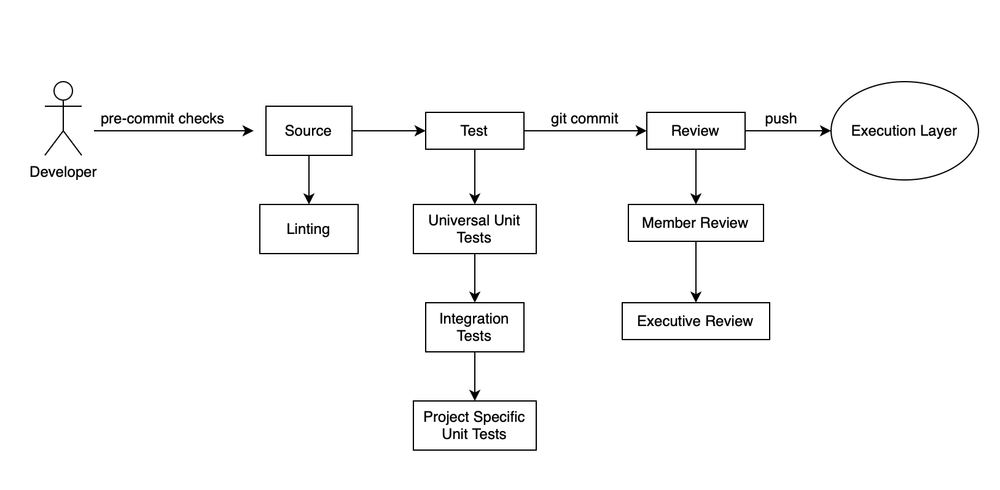

## Strategy Layer
# System Design
## Software Design Document

Name: Aneesha Shrestha

Date Created: 9/24/2025

Date Last Updated: 9/24/2025

## Summary

- [1 Introduction](#1-introduction)
- [2 System Overview](#2-system-overview)
- [3 System Architecture](#3-system-architecture)
- [4 Data Design](#4-data-design)
- [5 Component Design](#5-component-design)
- [6 Human Interface Design](#6-human-interface-design)
- [7 Requirements Matrix](#7-requirements-matrix)
- [8 Appendices](#8-appendices)

## 1 Introduction

### 1.1 Purpose
The current goal of the club is to create a fully functional backtesting system in which to create and test quantitative trading strategies in the future. This system is comprised of 4 major layers:
1. Data Layer
2. Strategy Layer
3. Execution Layer
4. Reporting Layer

The data layer holds the stock market data which algorithms can be tested against. The strategy layer is where trading strategies and algorithms are developed, tested for integrity, and reviewed before sending them to the execution layer. The execution layer is where strategies are implemented and tested against the data held in the data layer, or live-traded. The reporting layer is where the results of the execution layer are posted, and developers can see how well their strategy performed.

This document will focus on the structure and implementation of the Strategy Layer. 

The purpose of this document is to define a CI/CD pipeline that club members will use to submit trading strategies into the backtesting system. It explains the required submission process and establishes a standard structure that every strategy must follow before moving to the execution layer. The structure is designed to balance flexibility with consistency, ensuring the system can reliably process all submissions. Finally, the document outlines the testing requirements that each strategy must pass, reducing the workload for reviewers and improving overall code quality.

### 1.2 Scope
The scope of this project falls within the Strategy Layer of the backtesting system. It is responsible for creating a structure for the following:
- Standardizing how members write and submit trading strategies
- Enforcing structure and coding standards on algorithms
- Running linting and testing on algorithms prior to their execution
- Providing a CI/CD pipeline for submission, validation, and movement into the execution layer.

It is not responsible for:
- Querying into any data set
- Executing any code
- Displaying any analytics
- Designing individual strategies

The primary goals are to reduce reviewer workload, enforce consistent coding practices, and make strategy submissions both flexible and reliable. The benefits include higher-quality code, smoother collaboration, and a scalable process that prepares members for real-world software development practices.

### 1.3 Overview
This document is organized into several sections. Section 1 introduces the purpose, scope, and context of the Strategy Layer. Section 2 provides a detailed description of the project and outlines the requirements for submitted strategies. Section 3 explains the CI/CD process in depth, including a system diagram and the rationale for the chosen approach. Section 4 describes the tools and technologies used to implement the system.

### 1.4 Reference Material
How to design a modern CI/CD Pipeline:
https://www.youtube.com/watch?v=KnSBNd3b0qI

Pylint documentation:
https://pylint.pycqa.org/en/stable/tutorial.html

### 1.5 Definitions and Acronyms
- Backtesting
   - A tool that allows traders and investors to test and evaluate the potential profitability and risk of a trading strategy using historical market data
- CI/CD Pipeline
   - Continous Integration Continous Deployment
   - Automated workflow that streamlines the software development cycle by breaking into stages
- Linter
   - Static code analysis tool used to flag potential errors, bugs, stylistic issues, and suspicious constructs in source code
   - Examines code without executing it
   - Checks for adherence to coding standards and best practice
- Buy Signal
   - A boolean value that determines whether the algorithm should buy a certain stock
- Sell Signal
   - A boolean value that determines whether the algorithms should sell a position it currently holds
- Ticker
   - A short, unique abbreviation that identifies a publically traded company, or a security, on the stock exchange
   - ex. AAPL = Apple
- Unit Tests
   - Software testing practice that verifies the correct functionality of the smallest, isolated, and testable parts of an application
- Integration Tests
   - Software-testing approach in which various application components or modules are joined and tested to evaluate how well they work together
- Decoupling
   - Software design principle that reduces the dependencies between different components of a system, allowing them to be developed, deployed, and maintained independently with minimal impact on each othe

## 2 System Overview
The strategy layer is essentially the first step for a develper hoping to submit and test an algorithm in the overall backtesting system. The goal of this layer is to make each algorithm a "package" which can be sent to the next step, the execution layer. The execution layer is where the backtesting, or live trading, will actually happen, please see the Execution Layer SSD for more information. 

All strategies/algorithms submitted to the strategy layer must clearly outline the following:
- ** What stocks are to be monitored
   - ex. S&P 500 Companies
   - ex. Electrical commodities market
- ** What <u>about</u> the stocks should be monitored
   - ex. A list of technical indicators
   - ex. The average range of prices over a 6 month period
- ** Conditions of a buy signal
   - ex. RSI < 30
   - ex. Price value dips below lowest value in the average range
- ** How much to allocated towards a buy
   - ex. Always allocate 10% of liquid capital
   - ex. Always allocated $500
- ** Conditions of a sell signal (Exit Strategy)
   - This is essentially how long you stay in the buy and when you sell
   - ex. RSI > 70
   - ex. Price comes up to some expected range
- ** Dataset
   - Define what set of data to backtest upon
   - Or indicate live trading
   - ex. 2015-2025 S&P 500 prices

- ** Written Justification
   - Please write a paragraph or two explaining why you are trying this strategy, your hypothesis, and what makes it unique

The point of this system is to ensure submitted strategies follow this format. Therefore, we must create a system that ensures all of this information is provided by algorithms created by teams. 

Also, all systems must have been tested prior being sent to the execution layer. In addition to code meeting the above standards, it must also pass a series of unit and integration tests which will be developed by the strategy layer team.

## 3 System Architecture

### 3.1 Architectural Design
This structure will be enforced by at linting system that will go over the language of your code. Any algorithm submitted must define the following:
- class Strategy(ABC){}
- buy_signal(){} //returns boolean value
- sell_signal(){} //returns boolean value
- allocation(){} //returns how much money is allocated towards the buy
- char dataset = []; //this is should either be a list of tickers or a reference to a preconceived dataset
- a comment at the start of the code outlining
   - names of the creators of the algorithm
   - date of creation
   - date of last update
   - paragraph explaining the strategy and its rationale

All code submitted to the Github for review must first pass through the parsing system, which will be hosted on the club server. Club members can ssh into the server, submit their algorithm, and determine whether their code is up to standard. If it passes, members must take a screenshot of a successful submit and include it in the files for code review on Github. 

Then, members must submit their algorithm to be tested by a series of universal unit/integration tests. A screenshot of a 100% pass on all tests must also be submitted and included in the files on Github prior to review.

Third, members must have created their own project-specific unit tests. The tests should also be included in the file submitted to Github, along with an explanation of what the test is for, and screenshots showing successful completion. 

Finally, any algorithm submitted to the execution layer must be reviewed and approved by 2 club members, and at least one must be a member of the executive team. Reviewers CANNOT be a member of the team which developed the strategy. The reviewers must ensure the following:
   - The logic of each function is sound and will not result in  any bug that may impede the function of the code or the overall stability of the backtesting system. 
   - There are 3 screenshots showing that the algorithm passed both the parse test, universal unit/integration tests, and project-specific tests
   - If the project is to be live traded, that it is unique, and logically sound

### 3.2 Design Rationale
The reasoning for selecting this process are as follows:
1. Linting scanner reduces the workload for code reviewers
   - A linting scanner automatically filters out code that fails to meet basic standards.
   - This ensures reviewers only see submissions that already meet a minimum level of quality.
   - A parsing system is simpler to implement than a full sandbox environment for testing code.
2. Uniform structure
   - A consistent format makes strategies easier to read, review, and maintain.
   - Standardization provides a good learning experience for members by enforcing professional coding practices.
   - A shared baseline reduces time spent deciphering individual coding styles.
3. Decoupling
   - By having a standard structure, algorithms can be sent to the execution layer as a complete package.
   - This reduces the amount of interaction between the strategy and execution layer, effectively decoupling the two processes
   - Decoupling allows for greater flexibility in the backtesting system as a whole

The drawbacks of this process are as follows:
1. Still demands significant human participation.
   - Due to the simplicity of an linting system and the limits of universal unit/integration tests, there is still much labor required by both code reviewers and project members. Both must still be vigilant about the possibilities of untested issues that will effect the backtesting system as a whole
2. Limits in flexibility
   - Having a set structure of an algorithm may impede the flexibility of strategies in the future
3. Maintenance burden
   - As strategies evolve, the linting rules and testing framework will need updates. Keeping them current requires ongoing effort.
4. Potential for false security
   - Passing linting and automated tests does not guarantee a strategy is profitable, efficient, or even logically sound. Members may overestimate reliability.

## 4 Tools & Tech Stack

### 4.1 Tools
- Pylint
   - Used to create the linter
- pytest (or unittest)
   - Used to create automated testing for both the framework and submitted strategies.
- Github
   - Used for code review and version control
- Github Issues/Projects
   - CI/CD pipline 

### 4.2 Tech Stack
Language: Python
Version Control: Github
CI/CD: Github Issues/Projects
Testing Environment: Python Virtual Environment

## 5 Requirements Matrix
Requirement 1: A clear, standardized submission process into the backtesting system

Requirement 2: A system that can enforce code quality

Requirement 3: A system that can test code prior to sending it to the execution layer

Requirement 4: CI/CD automation to create a faster, more simple workflow

Requirement 5: A system that is decoupled from the other layers of the backtesting system

## 6 Appendices
Based on [Software Design Document (SDD) Template ](https://devlegalsimpli.blob.core.windows.net/pdfseoforms/pdf-20180219t134432z-001/pdf/software-design-document-2.pdf)

And https://gist.github.com/shenhab/14dbb9eb5422c07f497bf17de299b28d
